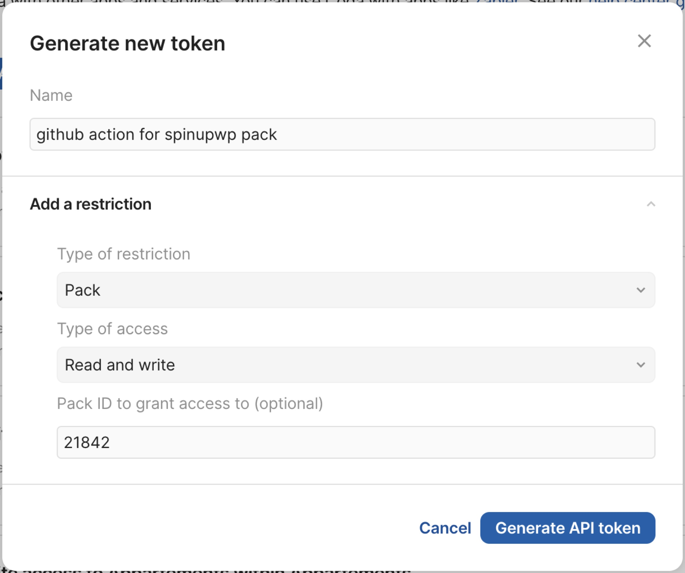

# upload-coda-pack

Simple GitHub Action to build and upload a Coda Pack to Coda.

## How to setup

### Generate and copy a Coda API token

Create and copy your Coda API token from your [account settings](https://coda.io/account#apiSettings).




### Add GitHub secret

Add it as a secret to your repo with the name `CODA_API_TOKEN`. (could be anything, but this is the default name used by the action)

I recommend you to generate a new token **for your project**, so you can easily revoke it if needed. Of course, you can also use your already existing personal token.

Here's how to add a secret to your repo using the GitHub CLI:

```bash
gh secret set CODA_API_TOKEN
```

See the GitHub documentation regarding secrets: [Creating encrypted secrets for a repository](https://docs.github.com/en/actions/security-guides/encrypted-secrets#creating-encrypted-secrets-for-a-repository)

### Add the action to your workflow

Add the action to your workflow file, for example `.github/workflows/upload-pack.yml`

You'll find a template repo with a working example here: [coda-workflows/upload-pack.yml at main · siriusnottin/coda-workflows · GitHub](https://github.com/siriusnottin/coda-workflows/blob/main/.github/workflows/upload-pack.yml)

You'll need to pass the following parameters to the action:

- `codaApiToken`: The Coda API token you generated and added as a secret to your repo.
- `packPath`(optional): The path to the pack file. Defaults to `pack.ts`.

### Create, commit and push a new branch

It depends on the workflow you've adopted, but here's a simple usage:

Create a new branch matching the `release/*` pattern, for example `release/v1.0.0`.

**Commit and push your changes to the new branch and it will trigger the action.**

## Usage

When pushing commits to a branch matching the `release/*` pattern, the action will automatically build and upload a new version of the pack to Coda for you to test.

## Action Details

### Inputs

| Name | Description | Required | Default |
| --- | --- | --- | --- |
codaApiToken | The Coda API token you generated and added as a secret to your repo. | true | |
packPath | The path to the pack file. | false | pack.ts |

### Outputs

| Name | Description |
| --- | --- |
| packVersion | The version of the uploaded pack. |

## Examples

### Basic

```yaml
name: Upload Coda Pack

on:
  push:
    branches:
      - release/*

jobs:
  upload-coda-pack:
    runs-on: ubuntu-latest
    steps:
      - uses: actions/checkout@v2
      - uses: siriusnottin/upload-coda-pack@v1
        with:
          codaApiToken: ${{ secrets.CODA_API_TOKEN }}
```

### With custom pack path

```yaml
name: Upload Coda Pack

on:
  push:
    branches:
      - release/*
jobs:
  ...
    steps:
    - uses: ...
      with:
        codApiToken: ${{ secrets.CODA_API_TOKEN }}
        packPath: pack.ts
```

## Useful Links

[Coda Packs](https://coda.io/product/packs) • [Coda API docs](https://coda.io/packs/build/latest/)

[GitHub Actions Documentation](https://docs.github.com/en/actions)

## Contribute

Feel free to contribute by opening an issue or submitting a pull request.

## License

MIT License. See the [LICENSE](LICENSE) file for more information.
